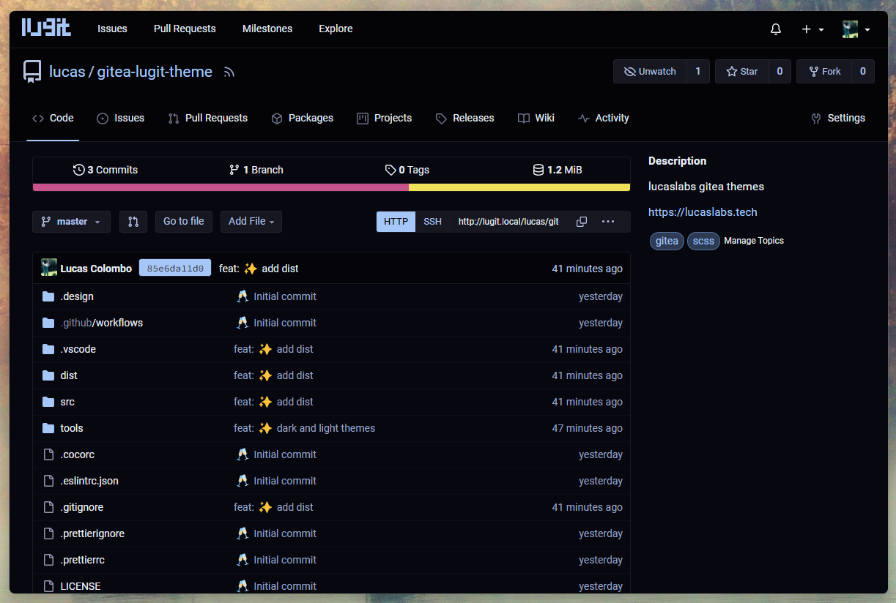
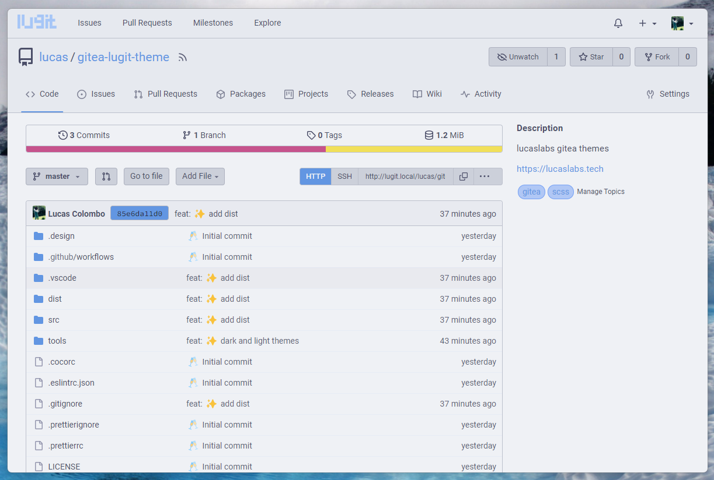

<h1 align="center">
	<code>lucaslabs</code> › <a href="https://gitea.io">Gitea</a> theme
</h1>

*Theme for `lucaslabs` internal gitea server.*

## `dark`



## `light`



## Usage

1. Clone this repo
2. Place the files in the `dist` folder in your `$GITEA_CUSTOM` directory.
3. Append the themes in your `app.ini` file:

```ini
[ui]
THEMES=...,dark,light
DEFAULT_THEME=dark # optional
```

> 💡 You can change the names of the themes by changing the name of the theme files in `public/css/theme-{name}.css` and in the `app.ini` file, accordingly.

4. Restart `gitea`.

> 🗒️ **Note**\
> Works with `gitea` version `v1.20`.

## Credits

- [`catppuccin/gitea`](https://github.com/catppuccin/gitea), these themes are based on them.

## Dev

### build
```bash
$ npm install
$ npm run build
```