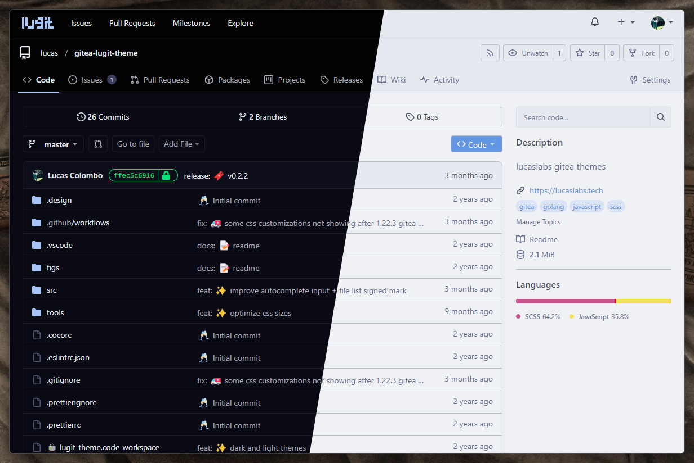
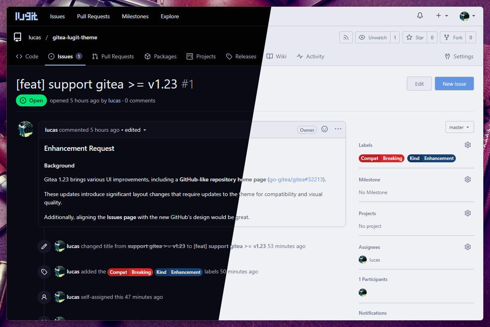
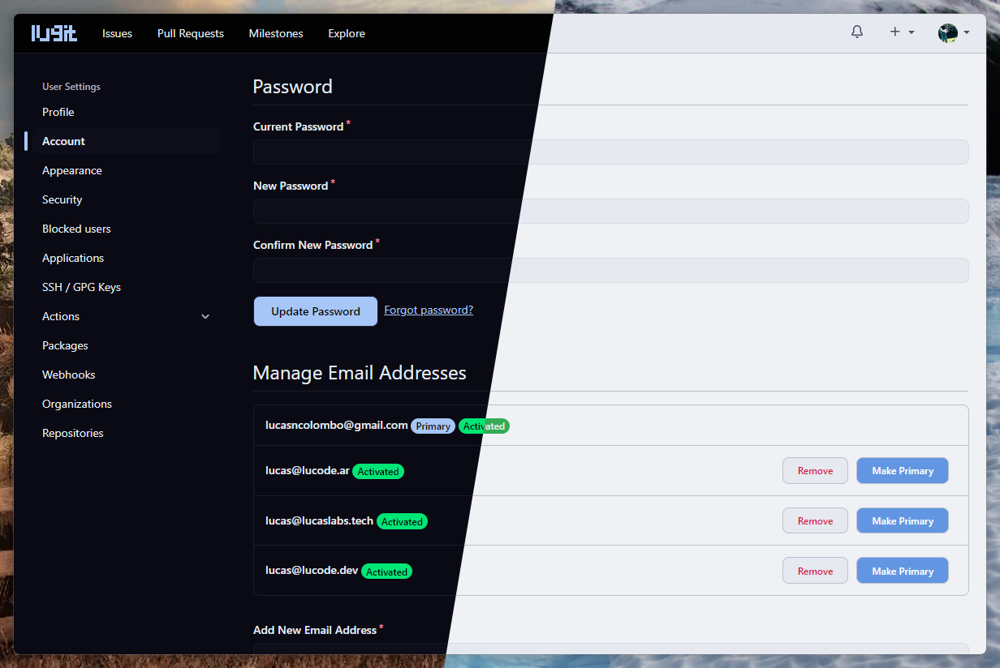
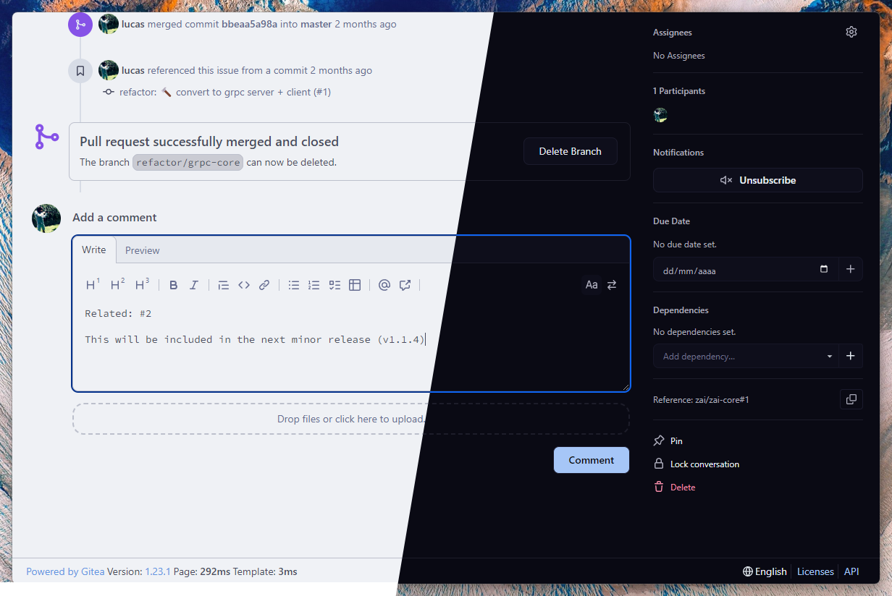

<h1 align="center">
	<code>lucaslabs</code> › <a href="https://gitea.io">Gitea</a> theme
</h1>

*Theme for `lucaslabs` internal gitea server.*

> [!IMPORTANT]
> From version `v1.0.0` onwards, `gitea>=1.23` is required.
> In case you're looking for `gitea@1.22.x` support, [`v0.2.2`](https://github.com/lucas-labs/gitea-lugit-theme/releases/tag/v0.2.2)
> is the last version that supports it.

## Preview



<details>
<summary>Issue Page</summary>

</details>

<details>
<summary>Settings Page</summary>

</details>

<details>
<summary>PR Page</summary>

</details>

## Usage

1. Go to the [releases page](https://github.com/lucas-labs/gitea-lugit-theme/releases) and get the latest `gitea-lugit-theme.tar.gz` release file.
2. Place the `templates` and `public` folder in your `$GITEA_CUSTOM` directory.
3. Append the themes in your `app.ini` file:

```ini
[ui]
THEMES=...,dark,light,auto
DEFAULT_THEME=dark # optional
```

> 💡 You can change the names of the themes by changing the name of the theme files in `public/css/theme-{name}.css` and in the `app.ini` file, accordingly.

4. Restart `gitea`.

## Credits

- [`catppuccin/gitea`](https://github.com/catppuccin/gitea), these themes are based on them.

## Development

### build
```bash
$ npm install
$ npm run build
```

### serve
```bash
$ npm run serve -- --server path/to/gitea/custom

# e.g.

# on linux
$ npm run serve -- --server ~/gitea/custom
# on windows
$ npm run serve -- -- --server c:/gitea/custom
```

## Contributing

Feel free to open an issue or a pull request. Contributions are welcome!